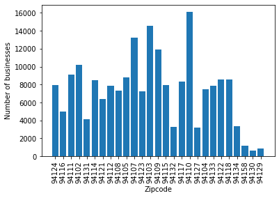

# Building Permit Prediction

## Modelling San Francisco Building Permits

### Description of Project

This project analyzes the permit approval process in the city of San Francisco. Modeling the timeline of a permit would allow businesses to optimize some of their operations. And insight into the factors that influence a permit’s filing would provide cities with tools to further their commercial development.

We built two overall models. The first predicts the number of days it takes for a permit to be issued since it was filed based on features about the building modification. The other model predicts the number of permits that are filed in a given zip code based on the business and residential activity in that zip code. 

We first considered analyzing building permit applications in New York City, but instead decided to work with equivalent data from San Francisco. The NYC dataset contains 3.6 million permit records and spans 14 columns [NYC Permit Data](https://data.cityofnewyork.us/Housing-Development/DOB-Permit-Issuance/ipu4-2q9a). The San Francisco dataset contains 200,000 permit records and spans 43 columns [SF Permit Data](https://www.kaggle.com/aparnashastry/building-permit-applications-data). Columns here include similar information as in the NYC data, including both details about the permit itself and external details about the project that the permit covers. However, the data for SF is far cleaner and more consistently recorded. Our plan is to first investigate and develop models for the SF data, and then see if our model can generalize onto samples from the NYC dataset.

Secondary features we are incorporating into this project are location data regarding businesses, restaurants, and fire reports. We are using business data for San Francisco collected by the Treasurer & Tax Collector’s Office [Business Data](https://data.sfgov.org/Economy-and-Community/Registered-Business-Locations-San-Francisco/g8m3-pdis). The Health Department of San Francisco has made available a dataset of restaurant violations [Health Data](https://data.sfgov.org/Health-and-Social-Services/Restaurant-Scores-LIVES-Standard/pyih-qa8i). Finally, the SF Fire Department has made available a database for fire incidents [Fire Data](https://data.sfgov.org/Public-Safety/Fire-Incidents/wr8u-xric/data). Figure 1 shows how the location features distribute over zip codes in San Francisco.

| |
|:-------------------------:|
|   Figure 1: Location Features Map |

### Data Exploration

The San Francisco permits dataset describes 43 features for 198,900 total building permit applications filed between 2013 and 2018. The dataset presented numerous challenges. There are about 1300 data points in the training set that are missing location data (including latitude and longitude, zip code, supervisor district, and neighborhood); almost all entries that have a missing value for one field has a missing value for all others. However, there are several fields that have 0 NA values. They are largely related to the information about the permits themselves (Permit Number, Current Status, Record ID, etc.), as well as the fields for block, lot, street number, and street name. We ultimately ignored the missing location data, as it represented less than 1% of total entries in the training set. For features describing the existing state of a building (e.g. its type of construction, the number of units in the building) and the “proposed” state after construction, permits often contained one value but not the other.

Another fundamental challenge of this dataset was that almost every categorical variable is dominated by 1 or 2 levels. Similarly, almost every interesting numerical variable (number of units and stories in the building, estimated cost of modification) is highly skewed right. This was partially responsible for the fact that few features in the dataset are independently predictive of the days to issue a permit. 

| | |
|:-------------------------:|:-------------------------:|
|   |   |
|   |   |

Figure 2: Intuitively predictive features are not actually (independently) predictive. Days-to-issue is highly dispersed across levels of categorical and numerical variables. This suggests that underfitting will be the main concern, and that complex models are needed.

We also had to deal with the role of time. Our early hypothesis was that San Francisco's development or permit approval process is changing over time (Figure 3), and we need to model that. But we believe this trend is simply due to the fact permit issue times that we can see are strictly limited by the last day this dataset was updated, and this limit goes down as permits are filed more recently. This phenomenon explains the clear, downsloping limiting line for days-to-issue in the plot below.

| | |
|:-------------------------:|:-------------------------:|
|   | Figure 3: Including the date as a feature would cause overfitting. We'd be significantly underpredicting out-of-sample, future permits simply because we can't possibly see long permit times for recently filed permits in this dataset. This is avoided if we exclude date as a feature (assuming included features are not correlated with date). |

The final problem is that 7.5% of permits in the dataset haven’t actually been issued. We believe that simply removing these when predicting days-to-issue would result in a sampling bias against them, as the fact that those permits weren't issued may be systematic. A regression model alone would be predicting permit issue times for a meaningful portion of future permits that won’t actually be issued, while only being trained on issued-permit data. 

| | |
|:-------------------------:|:-------------------------:|
|   | Figure 4: Another major obstacle we discovered while exploring the data is that the days to issue response variable is highly overdispersed and zero-inflated: the mean response is 26 days while the variance of the response is about 8,400 days2. And 63% of issued permits were issued the same day they were filed. This provided us more reason to complicate our model, as simple linearity assumptions don’t hold. |

After the work we did for the midterm report, we decided to add additional datasets to provide information about the locations in San Francisco that corresponded to the permits in our dataset. We chose three additional datasets: a dataset containing calls to the San Francisco Fire Department, a dataset containing businesses that paid taxes to the city of San Francisco, and a dataset containing information about restaurant inspections in San Francisco. We hoped to add relevant information about public safety, business and public amenities, and restaurants and sanitation. Figure 1 shows how these location features distribute over San Francisco.

The fire department dataset contained 5130694 entries and 34 features. However, we kept only the 2070872 entries that occurred at or after the first date in our building permit dataset (1/2/2013). We also created a feature for whether an ambulance was dispatched based on a feature for the date and time an ambulance was dispatched (which was NA if an ambulance was not dispatched). We finally only kept that feature, a feature for the call type, and features for the date and zip code. 

The business dataset contained 206026 entries and 10 features. We found that several entries were located outside San Francisco, including some located outside California entirely, so we only kept businesses with a zip code corresponding to zip codes in the building permit dataset; we also removed businesses that shut down before the first date in our building permit dataset, so we ended up with 199476 entries. We created several 1-hot encoded features based on a categorical feature for the type of business. 

The restaurant inspection dataset contained 53973 entries and 17 features; we removed 1186 features with an NA zipcode and 235 features with a zip code outside our building permit dataset. The dates were all in 2016 or later, so we didn’t remove any. However, there were 13011 NA values for the inspection score and 13256 NA values for the inspection risk rating, which may be a concern in determining the usefulness of those features. 

We then joined the fire department, business, and restaurant inspection datasets by zipcode, to create a dataset with 27 zipcode entries and 31 features about each zipcode. We also created 5 separate zipcode datasets by year, from 2013 to 2018; the datasets for 2013 to 2015 only had 26 features because there was no restaurant inspection data for those years.

| | | |
|:-------------------------:|:-------------------------:|:-------------------------:|
|   |   |   |

Figure 5: The number of fire department calls, businesses, and restaurant inspections by zipcode. The number of businesses is more evenly distributed, while the fire department and restaurant inspection datasets are more skewed towards particular zipcodes. The top four zipcodes are the same for the fire department and restaurant inspection datasets.

### Formulating and Training Models

#### Predicting days to issue a permit

To remedy the issues of systematically missing labels and zero-inflation, we built three models that occur in sequence:

1) Classify whether or not a permit will be issued by training on both issued and unissued permit data.

2) Classify whether or not an issued permit will be issued the same day it’s filed (such permits are referred to as “same-day” permits from now on).

3) Predict the number of days it takes for non-same-day permits to be issued. 

For model (1), we first explored whether combinations of existing features predicted issued and unissued permits well. We trained an SVM based on one-hot encodings of permit type, zip code, and construction type. These features were not indicative of issuance, as the SVM was no better than a model that classifies every permit as issued. This may be due to the fact that permits aren't unissued because of the underlying building modification or location, but rather something more technical in the permit process.

Our next hypothesis was that permits are rejected because they don't provide enough technical information. The binary feature that simply indicated whether a permit application’s “revised cost” was predictive, resulting in a classification rate of about 95.5% (or 3% better than the constant model). Tuning the margin hyperparameter of this SVM on a validation set did not yield any improvement.

Greater complexity was required for model (2). Here, an SVM was trained on the permit type, existing number of units in the building, the type of planset, and whether or not this permit was reserved for fire use. The classifier correctly predicts permits as being issued the same day 88% of the time, which is 25% better than the constant model. The sensitivity and specificity rates were similar.

Now that unissued and same-day permits are handled, we can more safely train on the rest of the data to construct model (3). We ultimately decided to fit a Random Forest regression tree.1 The idea behind a Random Forest is that while individual decision trees tend to overfit, an ensemble of independent, shallow ones will not. Random Forests are not only statistically advantageous though. They’re also computationally advantageous, as the ensemble can be constructed in O(d n log n) time. A drawback is that the model takes significant storage space.

| | |
|:-------------------------:|:-------------------------:|
|   | Figure 6: Days-to-issue is still overdispersed. Linear regression models trained on the whole dataset (including same-day permits) were severely underfitting. They usually reported a training RMSE of 75 days, even with a polynomial basis expansion. These initial models motivated the use of more complex, truly non-linear ones. |

The Random Forest was fit using the same features as the SVM in model (2). The choice to include these features was partially motivated by scatter-plots during EDA, but more so by numerous trials on training data where we fitted SVMs and Random Forests using other feature combinations. We computed errors of a few other feature combinations on the test set, but its substantial size allows us to still accurately report out-of-sample error by the Hoeffding bound. Interestingly, estimated cost and one-hot encoded zip codes did not yield any accuracy improvements for models (2) and (3). 
Mean absolute error (MAE) is a better metric than mean squared error (MSE) due to the high variance of days-to-issue. Model (3) ultimately had an RMSE of 107.8 days and a MAE of 47.5 days on the non-same-day dataset. On a more representative test set—one that includes same-day permits that were misclassified by model 2—the MAE is 51.5 days. 

| Purpose | Model | Error (Metric) |
| ------- | ----- | -------------- |
| (1) Classify issued or not | SVM | 4.5% (misclassification rate) |
| (2) Classify same-day or not | SVM | 12.0% (misclassification rate) |
| (3) Predict days-to-issue | Random Forest | 51.5 days (MAE) |

Table 1: Summary of the days-to-issue model that internally involves three sequential ones.

As a final note, a GLRM was initially fitted using relatively high-dimensional features in order to impute missing values in the “existing” and “proposed” columns. But the optimizer took far too long to converge on our PCs. So we instead imputed missing values with medians. Furthermore, we doubt that smarter imputation would significantly remedy underfitting for our dataset because none of the features containing missing values were already predictive of days-to-issue.

#### Predicting number of permits in a zip code

We also decided to predict the number of permits filed in a zip code, based on information about the zip code from the fire department, business, and restaurant datasets, as well as based on data from previous years. We fit 3 models (which we will call models 4, 5, and 6 to avoid confusion):

4) Predict the number of permits in a zip code given fire department, business, and restaurant inspection data

5) Predict the number of permits in a zip code in a given year given the number of permits in the previous year

6) Predict the number of permits in a zip code in a given year given the number of permits in the previous year and the fire department and business data from the previous year (the restaurant inspection data was only provided for 2 of the 5 full years represented in our building permit dataset)

One central issue here is that this is a relatively “small data” problem: while the building permit dataset has over 100,000 samples, there are only 27 zip codes in San Francisco. Therefore, model (4) overfit when we used all 31 zipcode-based training features. We created a training set of 21 zip codes and a test set of 6 zip codes, and with linear regression, the mean absolute error on the training data was 0, while the mean absolute error on the test data was 1500.55, with true values ranging between 6421 and 13404.

Reducing the number of features to 4 (the total number of fire department calls, businesses, and restaurant inspections, as well as the average restaurant inspection score) simply increased both the training error (1700.07) and the test error (2200.21). 

Model (5) worked quite well: with a training set of the data from 2014-2016 and a test set of the data from 2017, the autoregressive linear model with data from a single previous year had a mean absolute error of 95.20 on the training set and 92.26 on the test set. The coefficient of the regression was 1.04, with an intercept of 2.62, increasing a slight increase on average of permits from year to year. However, adding the zip code-based features to create model (6) only overfit, decreasing the training error (to 74.95) and increasing the test error (to 104.07).

### Interpretation of Results

Discuss how confident you are in your results. Would you be willing to use them in production to change how your company or enterprise makes decisions? If not, why not?

#### Days to issue a permit

For model (1), domain knowledge is needed to determine when “revised cost” is entered during the permit process. It's not something that's always entered after a permit is issued since we'd see 100% accuracy in that case. Assuming that the predictiveness of missing this field is not just an artifact of the permit approval process, we recommend that pending permits be updated with a revised cost during the application process in order to increase the chance of it being issued.

We believe model (2) is useful to business owners. Over half (i.e. (100% - 7.5%) * 63% * 88%) of all issued permits in San Francisco can now be correctly predicted to be issued the day they’re filed. This information may allow businesses to improve their scheduling of operations. For example, a repair can be booked for later in the day if a building owner knows that the repair will be approved early, which minimizes delays. Businesses can take advantage of this even if they’ve never filed a permit exactly of that kind or aren’t able to fill out all of the permit’s information.

Model (3) is not deployable. The error is greater than the average days-to-issue, and is especially high in the context of construction schedules. A greater number of and more complex features would need to be included for this model to be used in production.

#### Number of permits in a zip code

Of models (4), (5), and (6), model (5) had the best accuracy by far. However, the time period (2013-2017) was too short to determine if the model would fare well in the long term, and the effect of the model is hardly different from simply predicting that there would be as many permits in one year in a zip code as in the previous year. Model (4) was slightly successful, which indicates that the presence of different kinds of businesses, the number of restaurant inspections and variation in their scores, and the number of calls to the fire department have some correlation with the number of building permits filed in a year. Model (6) added features to model (5) but performed worse, so it has little to no value.

Therefore, I would trust model (5) on a short-term time period, and use it to make decisions in the sense that it would verify that the number of permits filed in a zip code have not changed drastically from year to year. Model (4) is less accurate, but is perhaps slightly more valuable: the business, fire department, and restaurant inspection datasets provide insight into what kind of place is in a zip code. For example, the dataset can provide insight into whether a zip code is more residential or more business-heavy, and whether it has public safety hazards (indicated by the fire department calls). It then uses this information to predict how many permits are filed in a location. Although model (4) needs more training data in the form of data from more zip codes, it could potentially be used to either approximate existing development when such information doesn’t exist, or predict increasing development, which would be useful when wanting to know which locations to invest more heavily in. 

### Model Trustworthiness

| | |
|:-------------------------:|:-------------------------:|
| | Figure 7: Location Features. Of concern is the high negative correlation between restaurant inspection score and number of building permit applications |

It is important to consider whether the models explored in this study would present opposition to quality and fairness among the residents of San Francisco; if our models exacerbate inequality or create discriminatory cycles among residents, then we have created a weapon of math destruction. Many of the models we explored classify San Francisco into distinct geographic regions, such as into distinct neighborhoods and postal zip codes. We also explored parameters that are specific to geographic zones, such as the number of businesses, the number of restaurants, and the number of fire incidents reported. These kinds of features are likely correlated with both racial and income classifications given historical clustering of communities and persistent income discrimination against minority groups. In our models geographic zones and location based features provided an increase in prediction accuracy when predicting the number of days required for a permit to be issued. Furthermore, the location features were highly correlated to the number of building permit applications in a given zip code.

Surprisingly, the number of building permit applications in a zip code is significantly negatively correlated to the total restaurant inspection scores in a zip code, as seen in Figure 7. These findings suggest that zip codes with lower total restaurant inspection scores have higher numbers of fire incidents, higher numbers of businesses, and higher numbers of building permit applications. A low restaurant inspection score can indicate a number of factors such as lower incomes, lower safety standards, higher population density, older buildings, and poor infrastructure. Of concern is that there is a significant negative correlation (-0.41) between restaurant inspection scores and total number of building permits in a zip code; this highlights a fundamental blindspot in our model - the data we have is restricted to what was collected and assembled into the SF Open Data repository.

Applying for a building permit officially can be neglected due to fear of the government, fear of increased building cost, and fear of community backlash; for instance, if there are illegal workers or cost-cutting practices systematically occuring within a community then this community will most likely neglect to apply for a building permit officially. The restaurant inspection scores may indicate that this is indeed the case in San Francisco for many restaurants, given that restaurant inspections are random and would sample restaurants throughout San Francisco more uniformly than our building permit application data may. In this case, our model will have a blindspot to the business and residences within these communities; the model will predict that there will be few building permit applications in those zones and in turn may lead to further decline in resource allocations and building investment in those zones. More strikingly, a low restaurant inspection score can result from not following the building permit application process fully and from not understanding proper building codes.

Fairness is a moderately important criteria in selecting our model. The result of a false positive in our case would mean that a building permit application which we predicted would move quickly through to being issued instead was not issued or took very long to issue. This case would be costly to business owners and real estate owners who closed their operations when preparing for construction. GIven that most building permits are issued very quickly it seems unlikely that a false positive would occur. The result of a false negative in this case would be that we predicted a building permit would take a very long time to be issued or would not be issued at all when instead the permit would have been issued without problem. The false negative is potentially more detrimental to disadvantaged communities because it could stifle new construction projects ranging from very small to large projects. The false negative could entrench communities’ preferences to neglect applying for building permits and could entrench other unsafe and illegal practices across the board.
For these reasons, fairness will need to be considered in our model to mitigate any possibility of creating a weapon of math destruction, particularly through false negatives.

