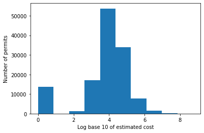
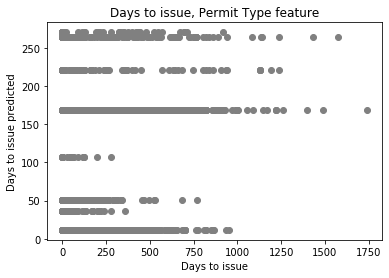
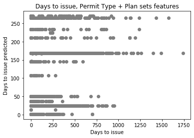
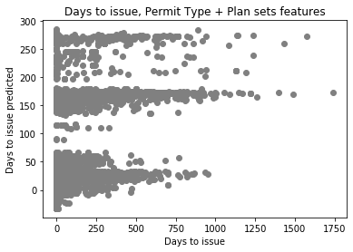

# Building Permit Prediction

### Description of Project

As a homeowner, property developer, real estate agent, contractor, or investor it is often pertinent to perform alterations or to construct additional structures on your property, and cities may require that a building permit be completed for these projects. Permit approval follows the process of first being filed with the local government, then being issued, and finally, once all relevant work on the property is finished, being completed.

Our aims in this project are to identify factors which affect whether a building permit will be issued, and how long it will take in days for a permit application to move from the filing stage to the issued stage. We have features in our dataset that will likely be predictive of these, such as the type of proposed construction, the type of the required permit, the location or neighborhood in which the construction will occur, and the overall size of the project. Additionally we will explore whether secondary location data such as number of businesses, number of restaurants, and number of fires in a zipcode are predictive of both how long in days is required for a building permit application to be issued after filing, as well as, whether these location features are predictive of other location features.

We first considered analyzing building permit applications in New York City, but instead decided to work with equivalent data from San Francisco. The NYC dataset contains 3.6 million permit records and spans 14 columns [NYC Permit Data](https://data.cityofnewyork.us/Housing-Development/DOB-Permit-Issuance/ipu4-2q9a). The San Francisco dataset contains 200,000 permit records and spans 43 columns [SF Permit Data](https://www.kaggle.com/aparnashastry/building-permit-applications-data). Columns here include similar information as in the NYC data, including both details about the permit itself and external details about the project that the permit covers. However, the data for SF is far cleaner and more consistently recorded. Our plan is to first investigate and develop models for the SF data, and then see if our model can generalize onto samples from the NYC dataset.

Secondary features we are incorporating into this project are location data regarding businesses, restaurants, and fire reports. We are using business data for San Francisco collected by the Treasurer & Tax Collector’s Office [Business Data](https://data.sfgov.org/Economy-and-Community/Registered-Business-Locations-San-Francisco/g8m3-pdis). The Health Department of San Francisco has made available a dataset of restaurant violations [Health Data](https://data.sfgov.org/Health-and-Social-Services/Restaurant-Scores-LIVES-Standard/pyih-qa8i). Finally, the SF Fire Department has made available a database for fire incidents [Fire Data](https://data.sfgov.org/Public-Safety/Fire-Incidents/wr8u-xric/data).

### Data Exploration

There are two physical limitations to the dataset that could lead to overfitting. The first is that we can only see the issue time for permits that have been issued. This suggests that a regression model alone would be predicting permit issue times for a meaningful portion of future permits that won’t actually be issued, while only being trained on issued-permit data. To prevent this, we’ll build two models that occur in sequence. The first classifies whether or not a permit will be issued by training on both issued and unissued permit data. The second predicts the number of days for a permit to be issued by training on permits that we know were eventually issued. So for a new permit, first classify whether or not it will be issued. If so, predict the number of days that will take. The second limitation is that we can't see long issue times for recently filed permits like we can for old permits. For example, today, we can't possibly see the permit issue time for one filed in 2018 that takes 2 years or more to be issued. So including the date as a feature would cause overfitting. We'd be underpredicting future permits simply because we can't possibly see long issue times for recently filed permits in this dataset. This is avoided by excluding date as a feature. Figures 1 and 2 below demonstrates these issues in the data.

| | |
|:-------------------------:|:-------------------------:|
|   Figure 1: Permit status |   Figure 2: Days to issue vs. date filed |

One simple way to remedy underfitting for the regression model is to shift any negative predictions to 0, since we know days to issue is at least 0. We’ll test the effectiveness of the classification model by misclassification rate. We’ll test the effectiveness of the regression model by root MSE, as days is an interpretable error unit. 

Looking at the distribution of permit statuses in the SF dataset in Figure 2, we see that the majority are either "completed", "issued", or "filed"; however, there are a total of 14 categories represented. Given that we are interested in predicting how long it will take a building permit to move from "filed" to "issued" or "completed", it is encouraging that there are many entries to work with.

When we look at the columns of "Filed date", "Issued date, and "Completed date" we see that 100% of all permits have been filed, 92.5% have been issued, and 48.9% have been completed. It is encouraging that all listed permit records have an issued date and the high proportion of permits which have been issued provides ample training data. If we look closer, we see that 62.8% of all permits are issued on the same day that they were filed.

As is evident in the histograms below, many of the categorical and boolean features have one value in a clear majority, which could limit the effectiveness they may have. We can see an example of this in Figure 1, where the vast majority of values of Permit Type are 8. The definitions for the permit types are as follows: 8 = otc alterations permit, 3 = additions alterations or repairs, 4 = sign - erect, 2 = new construction wood frame, 6 = demolitions, 7 = wall or painted sign, 1 = new construction, 5 = grade or quarry or fill or excavate.

| | | |
|:-------------------------:|:-------------------------:|:-------------------------:|
|  Figure 3: Permit types |  Figure 4: Zipcodes |  Figure 5: Log base 10 estimated cost |

However, there are three location features with predefined regions that have variation in the number of permits. For example, in Figure 4, Zipcode 94110 has a clear plurality, with 14228 permits; it also has a large overlap with the Mission neighborhood, which has the second-highest number of permits among neighborhoods. Zipcode 94129 has the least number of permits, 20. There are also 1360 NA values for zipcode. In Figure 5 it is shown that there is a large range for estimated cost, with the minimum value being $1 and the maximum value being $537,958,646, and 13623 less than $10 and 2134 values over $1 million. We use a log scale to display this more compactly. 

There are 198,900 total permits, and 43 columns; of these, we removed 4 columns. We did an 80-20 train-test split, so the training set has 159120 entries, and the test set has 39780 entries. We removed TIDF compliance because only 2 entries in the training set were not NA, and we removed 3 other columns for being completely redundant (they were Permit Type Definition, Existing Construction Type Description, and Proposed Construction Type Description, and they were equivalent to Permit Type, Existing Construction Type, and Proposed Construction type respectively).

There are about 1300 data points that are missing location data (including latitude and longitude, zip code, supervisor district, and neighborhood); almost all entries that have a missing value for one has a missing value for all others. However, there are several fields that have 0 NA values; they are largely related to the information about the permits themselves (Permit Number, Current Status, Record ID, etc.), as well as the fields for block, lot, street number, and street name. 

### Preliminary Predictions

Permit type is a categorical feature and is encoded as a one-hot vector. The constant model would predict every permit as being issued, which works for 91.5% of permits on a mini test set of 3,000 permits. A one-feature SVM (trained on a mini training set) correctly classified about 92.5% of the mini test set permits, which demonstrates that ‘Permit Type’ alone is only slightly predictive. This suggests that more features should be added.

Running a linear regression in which we predict the number of days for a permit to move from being in the filed stage to the issued stage, using only the permit type as a feature, we obtain the predictions seen in Figure 6. The mean square error (MSE) here is 5742. Adding the number of plan sets as a feature improves the prediction, as is seen in Figure 7. The MSE in this case is 5627. Finally, adding the following features: proposed construction type, zipcode, supervisor district, existing construction type, and neighborhood improves the prediction as seen in Figure 8. The MSE in this case is 5595.

| | | |
|:-------------------------:|:-------------------------:|:-------------------------:|
|  Figure 6: Model 1 |  Figure 7: Model 2 |  Figure 8: Model 3 |

### Location Information

