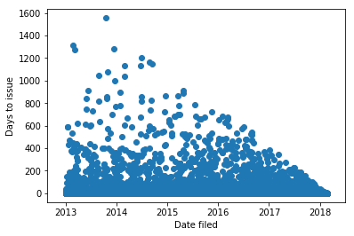

# Building Permit Prediction

### Description of Project

As a homeowner, property developer, real estate agent, contractor, or investor it is often pertinent to perform alterations or to construct additional structures on your property. Whether the project is to renovate the front porch on your house or to construct a new guest-house in the backyard, cities require that a building permit be completed. A building permit is an official approval issued by the local government agency allowing you or a contractor to proceed with the construction or remodeling project. Permit approval follows the process of first being filed, then being issued, and finally, once all relevant work on the property is finished, being completed.

Our aims in this project are to identify factors which affect whether a building permit will be issued, and how long it will take in days for a permit application to move from the fileing stage to the issued stage. Factors which will likely play a large effect are the type of proposed construction, the type of the required permit, the location or neighborhood in which the construction will occur, and the overall size of the project. It is reasonable to assume that smaller projects, such as ones where a landlord is doing a minor remodeling, will be approved much faster than a permit for construction of a large, new apartment complex. Other factors which are of interest to our project are local crime statistics, traffic patterns, and local mass-transit options surrounding the propsed construction site.

For this project data for building permit applications in New York City and San Francisco are being considered. The NYC dataset contains 3.6 million permit records and spans 14 columns [NYC Permit Data](https://data.cityofnewyork.us/Housing-Development/DOB-Permit-Issuance/ipu4-2q9a). Columns identify many important factors including location information, permit type, job type, and owner information in addition to the dates of fileing, issuing, and completion. The San Francisco dataset contains 200,000 permit records and spans 43 columns [SF Permit Data](https://www.kaggle.com/aparnashastry/building-permit-applications-data). Columns here include similar information as in the NYC data; however, the data is far cleaner and more consistently recorded. Our plan is to first investigate and develop models for the SF data, and then see if our model can generalize onto samples from the NYC dataset.

### Data Exploration

There are two physical limitations to the dataset that could lead to overfitting. The first is that we can only see the issue time for permits that have been issued. This suggests that a regression model alone would be predicting permit issue times for a meaningful portion of future permits that won’t actually be issued, while only being trained on issued-permit data. To prevent this, we’ll build two models that occur in sequence. The first classifies whether or not a permit will be issued by training on both issued and unissued permit data. The second predicts the number of days for a permit to be issued by training on permits that we know were eventually issued. So for a new permit, first classify whether or not it will be issued. If so, predict the number of days that will take. The second limitation is that we can't see long issue times for recently filed permits like we can for old permits. For example, today, we can't possibly see the permit issue time for one filed in 2018 that takes 2 years or more to be issued. So including the date as a feature would cause overfitting. We'd be underpredicting future permits simply because we can't possibly see long issue times for recently filed permits in this dataset. This is avoided by excluding date as a feature. Figure 1 below demonstrates these issues in the data.

Figure 1: Permit issue times that we can see are limited by the last day this dataset was updated, and the limit decreases as permits are filed more recently. This phenomenon explains the clear, downsloping limiting line in the plot. 

One simple way to remedy underfitting for the regression model is to shift any negative predictions to 0, since we know days to issue is at least 0. We’ll test the effectiveness of the classification model by misclassification rate. We’ll test the effectiveness of the regression model by root MSE, as days is an interpretable error unit. 

Looking at the distribution of permit statuses in the SF dataset in Figure 2, we see that the majority are either "completed", "issued", or "filed"; however, there are a total of 14 categories represented. Given that we are interested in predicting how long it will take a building permit to move from "filed" to "issued" or "completed", it is encouraging that there are many entries to work with.

Figure 2: Distribution of permit statuses shows clear majority classes.

When we look at the columns of "Filed date", "Issued date, and "Completed date" we see that 100% of all permits have been filed, 92.5% have been issued, and 48.9% have been completed. It is encouraging that all listed permit records have an issued date and the high proportion of permits which have been issued provides ample training data.

If we look closer, we see that 62.8% of all permits are issued on the same day that they were filed.

As is evident in the histograms below, many of the categorical and boolean features have one value in a clear majority, which could limit the effectiveness they may have. The definitions for the permit types are as follows: 8 = otc alterations permit, 3 = additions alterations or repairs, 4 = sign - erect, 2 = new construction wood frame, 6 = demolitions, 7 = wall or painted sign, 1 = new construction, 5 = grade or quarry or fill or excavate.

| | | |
|:-------------------------:|:-------------------------:|:-------------------------:|
|  Figure 3: Permit types |   Figure 4: Existing construction type | Figure 5: Proposed construction type |
| Figure 6: Plansets |   Figure 7: Street names| Figure 8: Supervisor distrcit|
| Figure 9: Zipcodes |   Figure 10: Neighborhoods | Figure 11: Latitude| Figure 11: Longitude|  Figure 12: Log base 10 estimated cost|  Figure 13: Number of existing stories|  Figure 14: Number of existing stories <= 10|

### Preliminary Predictions

Running a linear regression in which we predict the number of days for a permit to move from being in the filed stage to the issued stage, using only the permit type as a feature, we obtain the following predictions in comparison to the test data. Our mean square error (MSE) here is 5742.

Adding the number of plan sets as a feature improves the prediction, as is seen below. The MSE in this case is 5627.

Add the following features: proposed construction type, zipcode, supervisor district, existing construction type, and neighborhood improves the prediction as seen below. The MSE in this case is 5595.

